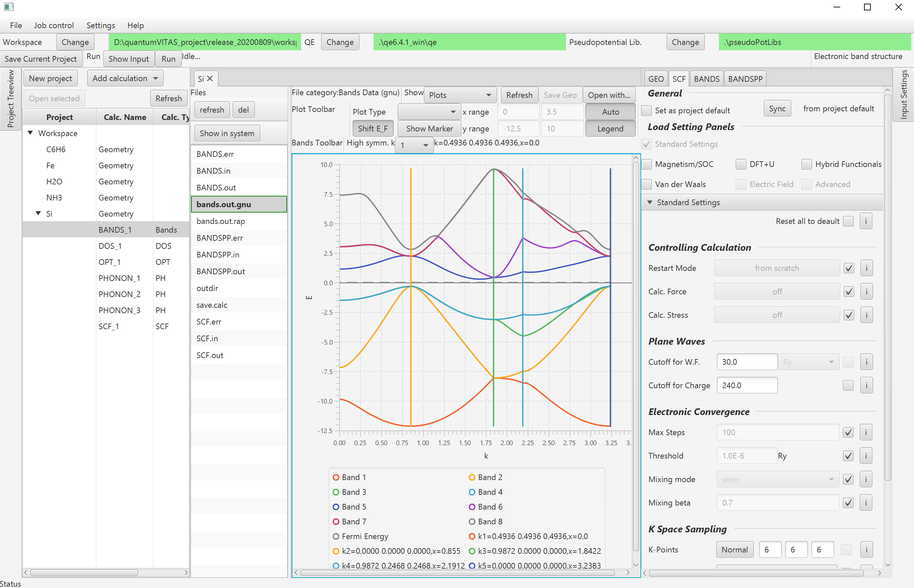

QuantumVITAS (Quantum Visualization Interacting Toolkit for Ab-initio Simulations) is a graphical user interface designed for ab-initio simulation software Quantum ESPRESSO, aiming at making ab-initio simulations easily accessible and intuitively controllable in various operating systems. It integrates input file generation, calculation job control, result analysis and data managment into a user interface. In the future we might integrate other engines besides Quantum ESPRESSO. For more information, feel free check out my [introduction video](https://www.youtube.com/watch?v=S2e1TWx6DHs).

## Download releases 

The project is actively evolving, and we have offered [the first three early access releases](https://github.com/quantumVITAS/quantumVITAS/releases/) with detailed feature lists. We appreciate any bug report or suggestion for feature implementation for the next step. A guide of [download](https://www.quantumvitas.org/download/) and [quick start](https://www.quantumvitas.org/quick-start/) can be found in the official website.

## Requirements

*   Java Runtime Environment (JRE) 1.8: https://java.com/en/download/
*   Windows/Linux/Mac OS

## Highlighted features

Please refer to the [release page](https://github.com/quantumVITAS/quantumVITAS/releases/) for a detailed feature list. We would like to highlight the following features below:
* Calculations implemented:
    * Self-consistency (SCF)
        * Magnetism and spin orbital coupling (SOC)
        * DFT+U
        * Hybrid functionals
        * Van der Waals corrections
    * Structural optimization/relaxation (OPT)
    * Density of states (DOS)
    * Band structure (including spin polarized and SOC)
    * Molecular dynamics (Born–Oppenheimer MD)
    * Time-dependent density-functional theory (TDDFT)
    * Phonon (gamma point, DOS, dispersion, raman, dielectric constant)
    * NEB (Nudged Elastic Band) for transition energy barrier calculation
    * Projection to atomic orbitals (to each atom or to each element, also in the spin polarized case and SOC)
        * Projected DOS calculation
        * Projected band structure (fat bands)
* Parallel/multicore computing supported (both openmp and mpirun) and job control
* Visualizations:
    * 3D viewer
    * Visualizations of the output of all calculations

## Main user interface 

## License

 Copyright (c) 2020 Haonan Huang.
 
 QuantumVITAS (Quantum Visualization Interactive Toolkit for Ab-initio 
 Simulations) is free software; you can redistribute it and/or modify
 it under the terms of the GNU General Public License as published by
 the Free Software Foundation, either version 3 of the License, or
 any later version.
 
 QuantumVITAS is distributed in the hope that it will be useful,
 but WITHOUT ANY WARRANTY; without even the implied warranty of
 MERCHANTABILITY or FITNESS FOR A PARTICULAR PURPOSE.  See the
 GNU General Public License for more details.
 
 You should have received a copy of the GNU General Public License
 along with QuantumVITAS.  If not, see <https://www.gnu.org/licenses/gpl-3.0.txt>.
